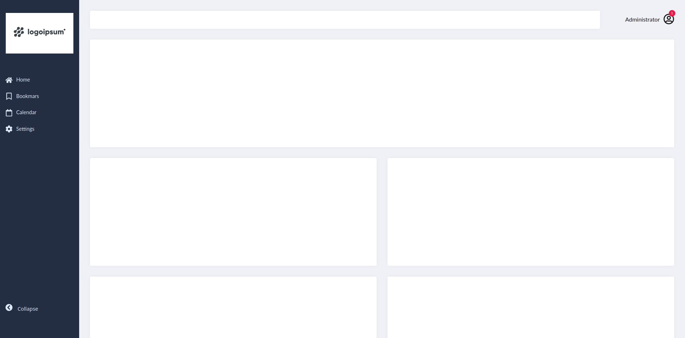

## Dockerized React Admin Panel

Minimal and lightweight admin panel written with :

<p float="left">


 


</p>

The application does not rely on any CSS Framework.
The CSS is all contained in ```./app/src/app.css```

# Requirements : 
- docker
- docker-compose

# Steps to follow : 

#### Clone the repository

```git clone https://gitlab.com/sf3ris/dashboard-react-rtk my-dashboard-app && cd my-dashboard-app```

##### Build and Run

``` docker-compose up -d --build --force-recreate```

#### Go To localhost:3000


